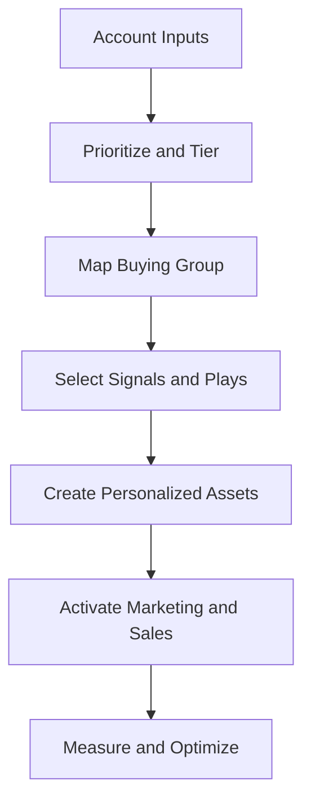

# AI-Powered ABM Command Center

> A reusable, platform-agnostic operating system for designing, activating, and measuring enterprise 1:1 and 1:few account-based marketing programs.


## Why This Exists

Enterprise ABM often breaks down between account selection, campaign execution, customer/account adoption, and Sales follow-through. This command center gives Marketing and Sales one structured workflow for turning account signals into coordinated, measurable plays.

It is designed for complex AI, cloud, cybersecurity, and enterprise SaaS buying groups—without using confidential customer, employer, or pipeline data.

## What It Demonstrates

- Strategic account tiering and prioritization
- Buyer-group and persona mapping
- Intent-led orchestration using first- and third-party signals
- 1:1 and 1:few campaign design
- Marketing, BDR, AE, partner, and customer-success alignment
- AI-assisted research, personalization, and content development
- Pipeline measurement and executive reporting

## Command Center Workflow



## Repository Contents

| Resource | Purpose |
|---|---|
| [`skills/ai-powered-abm-command-center/SKILL.md`](skills/ai-powered-abm-command-center/SKILL.md) | Claude-compatible instructions for generating ABM strategy and activation plans |
| [`templates/account-prioritization-brief.md`](templates/account-prioritization-brief.md) | ICP, fit, intent, engagement, and opportunity scoring |
| [`templates/abm-campaign-brief.md`](templates/abm-campaign-brief.md) | Full campaign architecture for 1:1 or 1:few programs |
| [`templates/sales-alignment-brief.md`](templates/sales-alignment-brief.md) | Shared Marketing, BDR, and Sales activation plan |
| [`templates/measurement-scorecard.md`](templates/measurement-scorecard.md) | Account progression and pipeline measurement framework |
| [`examples/sanitized-cloud-security-example.md`](examples/sanitized-cloud-security-example.md) | Completed, fictional enterprise cybersecurity example |

## Recommended Inputs

Provide only the information available and label assumptions:

1. Business objective and offer
2. ICP and target-account list
3. Account tier or prioritization criteria
4. Buying-group roles and known contacts
5. Intent, engagement, product, or relationship signals
6. Sales stage, opportunity context, and account owner
7. Available channels, content, budget, and timing
8. Success metrics and reporting cadence

## Example Prompt

```text
Use the AI-Powered ABM Command Center to develop a 1:few campaign for
12 enterprise financial-services accounts evaluating cloud security platforms.
Prioritize accounts using fit, intent, engagement, and opportunity context.
Create the account thesis, buying-group map, message architecture, coordinated
Marketing/BDR/AE plays, asset plan, activation timeline, and measurement scorecard.
Clearly label all assumptions and do not invent account facts.
```

## Measurement Philosophy

The framework prioritizes account progression over isolated lead volume:

- Target-account engagement and buying-group coverage
- Meaningful meetings and sales-accepted engagement
- Opportunity creation, acceleration, and stage progression
- Pipeline influenced or sourced
- Win rate, velocity, expansion, and revenue impact

## Responsible Use

- Never upload confidential CRM records, personal data, customer information, or unreleased financial results to an unapproved AI environment.
- Treat intent as a prioritization signal—not proof of purchase intent.
- Require human review before external activation.
- Separate verified facts, hypotheses, and AI-generated recommendations.
- Use Bombora as an intent-data source within the 6sense workflow when applicable.

## Portfolio Note

This repository contains original, generalized frameworks and fictional examples created to demonstrate enterprise marketing strategy and AI-enabled workflow design. It does not contain proprietary employer or customer material.

## License

MIT License. See [`LICENSE`](LICENSE).
